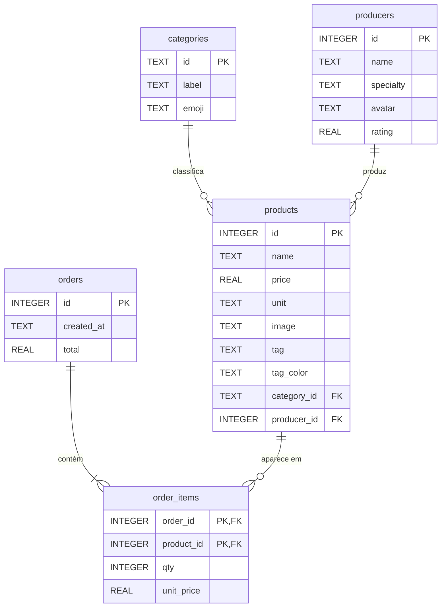

# Ali 
*O melhor do seu bairro, logo ali.*

---

##  Proposta de Valor
O **Ali** é um marketplace de nicho focado em conectar consumidores finais a pequenos produtores e comércios de bairro. Nós valorizamos o **fator humano**, a **sustentabilidade** e a **economia local**, oferecendo taxas justas para quem produz e transparência, proximidade e conveniência para quem consome.

##  O Problema e o Público-Alvo
Pequenos comerciantes e artesãos perdem visibilidade e margem de lucro nas grandes plataformas de delivery. Simultaneamente, consumidores conscientes têm dificuldade de encontrar produtos frescos, locais e com procedência de forma prática e centralizada. 

**Nosso Público:**
*   **Consumidores:** Pessoas que valorizam o consumo consciente, produtos artesanais/frescos e desejam apoiar a economia do próprio bairro.
*   **Produtores:** Padeiros artesanais, hortifrútis orgânicos, pequenas mercearias e empreendedores locais.

##  Principais Funcionalidades (MVP)
*   **Vitrine Humanizada:** Perfis de lojas que destacam a história de quem produz, não apenas a foto do produto.
*   **Geolocalização Hiperlocal:** Filtro de lojas e produtos focado estritamente na vizinhança.
*   **Transparência de Checkout:** Exibição clara da distribuição do dinheiro (fatia do produtor, frete e manutenção do app).
*   **Gestão de Pedidos:** Carrinho de compras simples e acompanhamento do status do pedido.

## Status do MVP

| Funcionalidade | Situação |
|---|---|
| Vitrine de produtos e produtores, filtro por categoria | ✅ Implementado (dados vindos do banco) |
| Carrinho e fechamento de pedido | ✅ Implementado (pedido gravado no banco) |
| Histórico de pedidos | 🟡 Disponível na API (`GET /orders`), ainda sem tela no app |
| Favoritos | 🟡 Só em memória, somem ao fechar o app |
| Login de usuários, geolocalização, status do pedido | ⬜ Não implementado |

## Tecnologias

| Camada | Tecnologia |
|---|---|
| App | Flutter (Dart), pacotes `google_fonts` e `http` |
| API | Python 3 + Flask |
| Banco de dados | SQLite (um único arquivo `.db`, acessado via SQL pelo módulo `sqlite3` do Python) |
| Execução | Docker Compose (nginx servindo a build web + container da API) |

## Arquitetura

```
┌────────────────────┐   HTTP / JSON    ┌──────────────────┐      SQL       ┌──────────────┐
│ App Flutter (web)  │ ───────────────▶ │  API Flask       │ ─────────────▶ │ SQLite       │
│ localhost:8090     │ ◀─────────────── │  localhost:5000  │ ◀───────────── │ ali.db       │
└────────────────────┘                  └──────────────────┘                └──────────────┘
```

1. Ao abrir, o app busca categorias, produtores e produtos na API.
2. O carrinho fica na memória do app até o usuário fechar o pedido.
3. Ao fechar o pedido, o app envia os itens (`POST /orders`). A API consulta os preços no banco, calcula o total e grava o pedido e os itens numa única transação.

## Estrutura do Projeto

```
.
├── lib/main.dart          # App inteiro: tema, modelos, cliente da API e telas
├── pubspec.yaml           # Dependências do Flutter
├── Dockerfile             # Build web do Flutter servida pelo nginx
├── docker-compose.yml     # Sobe app (web) + API (api) juntos
└── backend/
    ├── app.py             # API Flask: rotas e consultas SQL
    ├── schema.sql         # Criação das tabelas + dados iniciais
    ├── test_app.py        # Teste automatizado da API
    ├── requirements.txt   # Dependências Python (Flask)
    └── Dockerfile         # Imagem da API
```

## Como Rodar

### Com Docker (recomendado)
Pré-requisito: [Docker](https://docs.docker.com/get-docker/) com o plugin Compose.

```bash
docker compose up -d --build
```

- App: **http://localhost:8090**
- API: **http://localhost:5000**

| Ação | Comando |
|---|---|
| Ver logs da API | `docker compose logs -f api` |
| Parar (mantém o banco) | `docker compose down` |
| Parar e apagar o banco | `docker compose down -v` |

O banco fica no volume Docker `ali-data`, então os pedidos continuam salvos depois de reiniciar os containers.

### Sem Docker
Pré-requisitos: Python 3.10+ e o [Flutter SDK](https://docs.flutter.dev/get-started/install).

**1. API** (terminal 1):
```bash
cd backend
python -m venv .venv && source .venv/bin/activate   # Windows: .venv\Scripts\activate
pip install -r requirements.txt
python app.py                                       # fica rodando em http://localhost:5000
```

**2. App** (terminal 2, na raiz do projeto):
```bash
flutter create .      # só na primeira vez: gera as pastas android/, ios/, web/...
flutter pub get
flutter run -d chrome
```

No **emulador Android**, `localhost` aponta para o próprio emulador. Use o endereço do computador:
```bash
flutter run --dart-define=API_URL=http://10.0.2.2:5000
```

### Configuração

| Variável | Onde | Padrão | Para que serve |
|---|---|---|---|
| `API_URL` | App (`--dart-define`) | `http://localhost:5000` | Endereço da API |
| `DB_PATH` | API (variável de ambiente) | `backend/ali.db` | Caminho do arquivo do banco |

## Testes

Com a dependência instalada (veja *Sem Docker*), dentro de `backend/`:

```bash
python test_app.py    # imprime "ok" se tudo passar
```

O teste usa um banco temporário (não mexe no `ali.db`) e verifica:
- a listagem de categorias e produtos;
- o cálculo do total feito pelo servidor;
- a rejeição de pedidos inválidos.

## Banco de Dados

O esquema e os dados iniciais ficam em [`backend/schema.sql`](backend/schema.sql). Ele é executado automaticamente quando o arquivo do banco ainda não existe. Para recriar o banco do zero, apague o arquivo (ou rode `docker compose down -v`).



Regras garantidas pelo próprio banco:
- **Chaves estrangeiras:** um produto não pode apontar para categoria ou produtor inexistente.
- **`CHECK`:** preço ≥ 0, nota entre 0 e 5, quantidade > 0, `tag_color` só aceita `primary` ou `accent`.
- **`order_items.unit_price`:** guarda o preço do momento da compra, então o histórico não muda se o preço do produto mudar depois.

Para explorar o banco manualmente:
```bash
sqlite3 backend/ali.db                                        # sem Docker
docker compose exec api python -c "import sqlite3; print(sqlite3.connect('/data/ali.db').execute('SELECT * FROM orders').fetchall())"
```

## API

URL base: `http://localhost:5000`. Todas as respostas são em JSON.

| Método | Rota | Descrição |
|---|---|---|
| `GET` | `/` | Lista as rotas disponíveis |
| `GET` | `/categories` | Lista as categorias |
| `GET` | `/producers` | Lista os produtores |
| `GET` | `/products` | Lista os produtos com o nome do produtor (JOIN) |
| `POST` | `/orders` | Cria um pedido |
| `GET` | `/orders` | Histórico de pedidos com os itens, do mais recente ao mais antigo |

### `GET /products`
```json
[
  {
    "id": 1,
    "name": "Alface Crespa Orgânica",
    "producer": "Márcia Oliveira",
    "price": 4.5,
    "unit": "pé",
    "category": "hortalicas",
    "image": "https://images.unsplash.com/...",
    "tag": "Colhida hoje",
    "tag_color": "primary"
  }
]
```

### `POST /orders`
Requisição:
```bash
curl -X POST http://localhost:5000/orders \
  -H "Content-Type: application/json" \
  -d '{"items": [{"product_id": 1, "qty": 2}, {"product_id": 2, "qty": 1}]}'
```

Resposta `201 Created`:
```json
{ "id": 1, "total": 37.0 }
```

O cliente envia só o produto e a quantidade. **O preço e o total são calculados pelo servidor** com os valores do banco, então não dá para alterar o preço pelo app.

Erros retornam `400 Bad Request` com `{"error": "..."}` quando:
- a lista `items` está vazia ou ausente;
- algum item não tem `product_id` ou `qty` numéricos;
- a quantidade é ≤ 0;
- o produto não existe.

### `GET /orders`
```json
[
  {
    "id": 1,
    "created_at": "2026-10-05 13:02:10",
    "total": 37.0,
    "items": [
      { "product_id": 1, "name": "Alface Crespa Orgânica", "qty": 2, "unit_price": 4.5 },
      { "product_id": 2, "name": "Pão de Fermentação Natural", "qty": 1, "unit_price": 28.0 }
    ]
  }
]
```

## Limitações Conhecidas

- **Sem login:** todos os pedidos ficam num único histórico.
- **Frete:** a taxa de entrega (R$ 5,90) é somada só na tela do app. O `total` gravado no banco não inclui o frete.
- **CORS aberto (`*`):** adequado para desenvolvimento local, não para produção.
- **Servidor de desenvolvimento do Flask:** suficiente para a demonstração; em produção usaria um servidor WSGI (ex.: gunicorn).

## Identidade Visual
Identidade visual feita no Figma: [Paleta de cores e tipografia](https://www.figma.com/make/yARshU3yyoJSKwTi4iG9tR/Color-Palette-and-Typography?code-node-id=0-6&p=f&fullscreen=1)

---

##  Integrantes do Grupo
*   **Miguel Vanucci Delgado RM: 563491** - [Identidade Visual]
*   **Henry dos Santos Lima RM: 565309** - [Documentação inicial]
*   **Samuel da Silva Nunes RM: 564435** - [Pitch]
*   **João Vitor Lima RM: 566541** - [Desenvolvimento de marca]
*   **Lucas Werpp Franco RM: 556044** - [Desenvolvedor]


---
